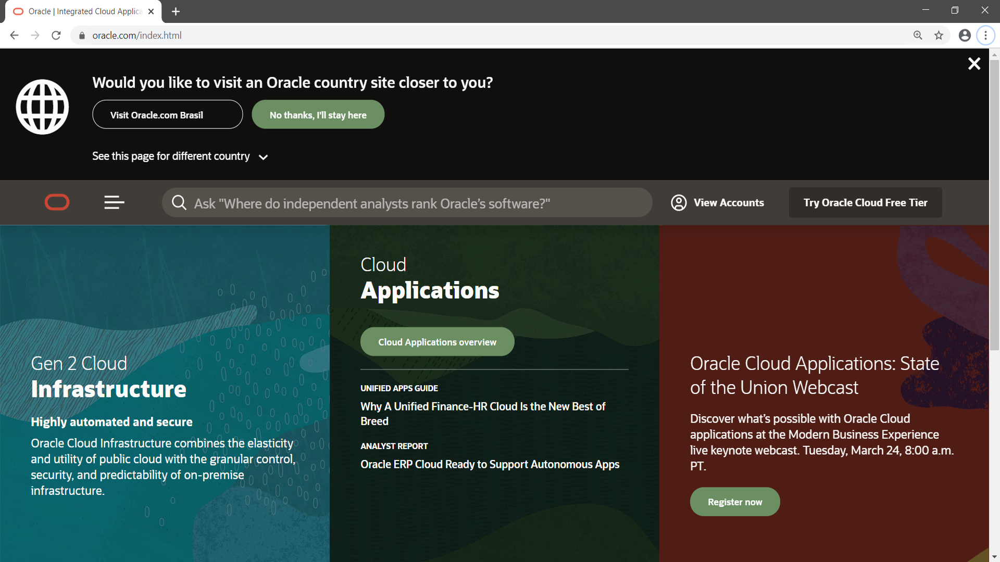
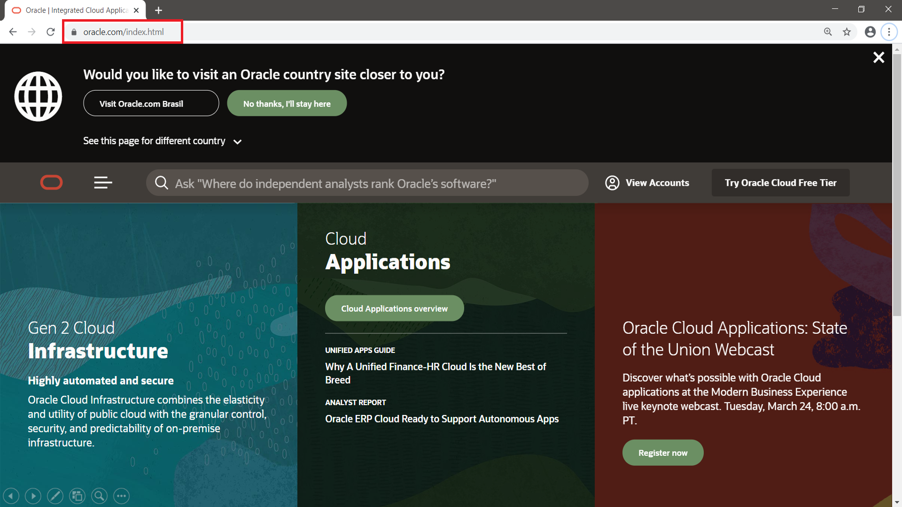
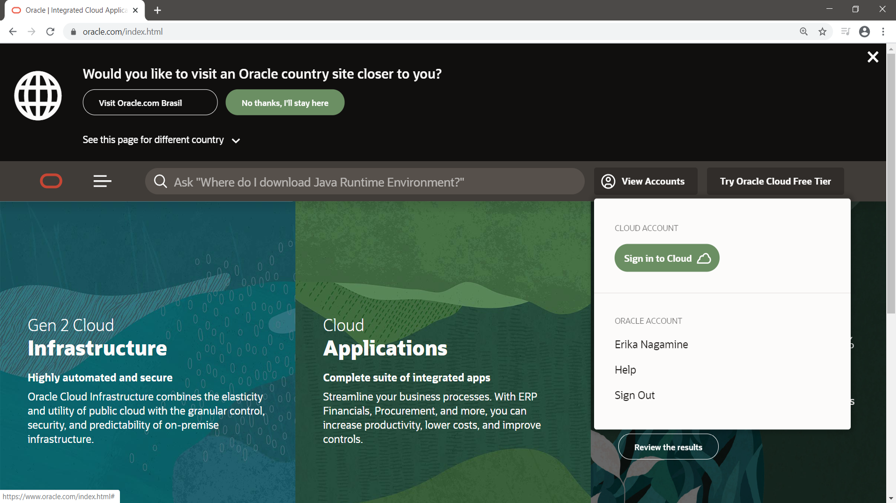
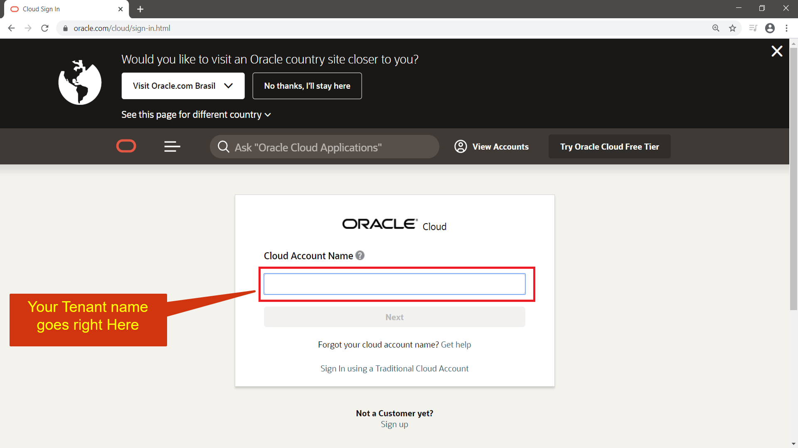
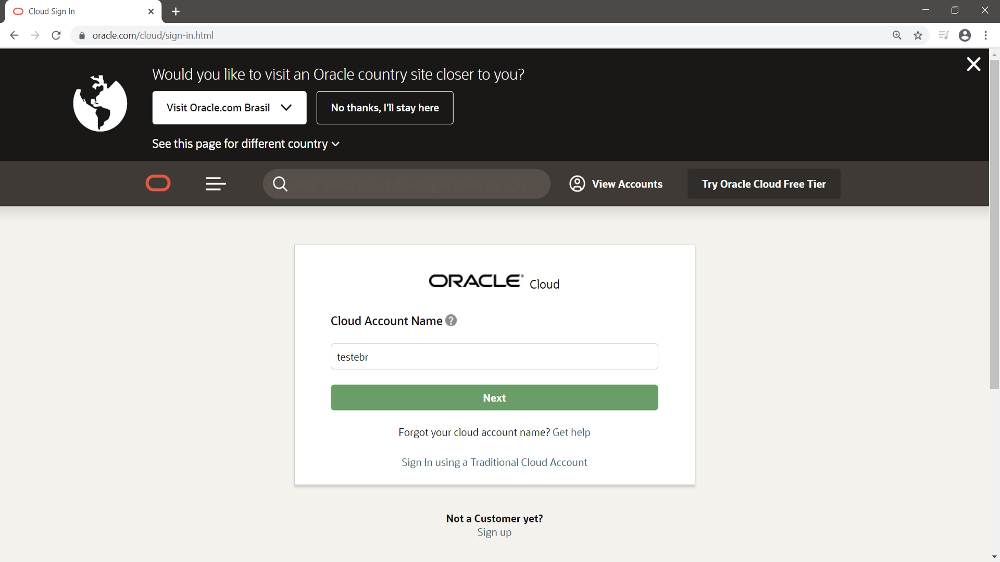
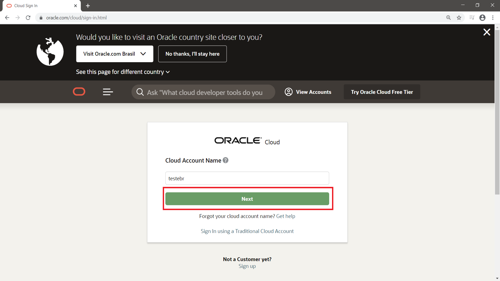
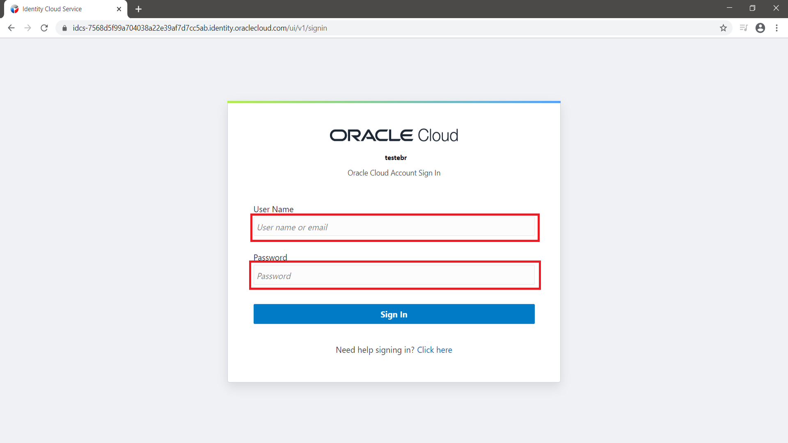
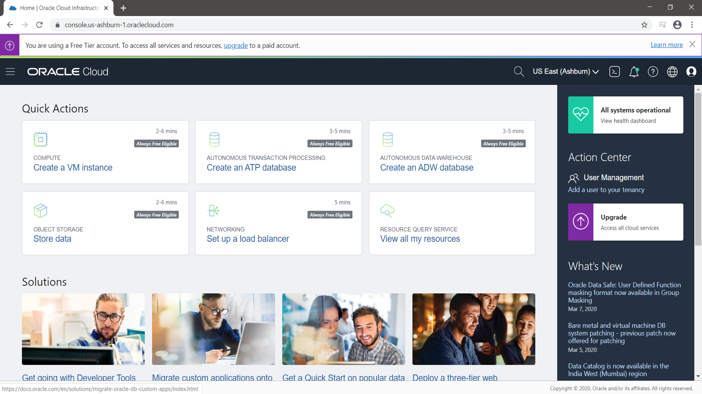

    #     ___  ____     _    ____ _     _____
    #    / _ \|  _ \   / \  / ___| |   | ____|
    #   | | | | |_) | / _ \| |   | |   |  _|
    #   | |_| |  _ < / ___ | |___| |___| |___
    #    \___/|_| \_/_/   \_\____|_____|_____|
***

# Autonomous Database

Oracle Autonomous database is an inovative platform for data, including for transaction and analytics data.

During this time, we will construct a integrated data platform with a transaction application and analytics application.

The main topics that we will execute during this time is:

<a name="#top">Menu:</a>

1. [ Accessing the Oracle Public Cloud ](#1)
2. [ Setup base Environment ](#2)
3. [ Provisioning Autonomous Transaction Processing (ATP) ](#3)
4. [ Provisioning Autonomous Data Warehouse (ADW) ](#4)
5. [ Provisioning Oracle Analytics Cloud (OAC) ](#5)
6. [ Create an application on APEX ](#6)
7. [ Import data from object storage ](#7)
8. [ Creating a dashboard on OAC ](#8)

<a name="1"></a>
# 1. Accessing the Oracle Public Cloud
On your web browser, visit the oracle [site](http://www.oracle.com "Oracle Official Site")



On Oracle website, go to "View accounts":




On "View Accounts" click in "Sign in to cloud":




On "Sign in" page, put the information about your cloud account:




Then click in next:





At this moment you need to inform your account and password:




Then click in next:


On Console page, you have the menu on the left top of the screen:




Menu contains all those services that you can use on cloud.

Also you have on the top of your screen the region that you are logged in: 


And you have your profile configuration on the top right of main page


[ Return to top ](#top)


<!-- blank line -->
----
<!-- blank line -->
<a name="2"></a>
# 2. Setup base Environment

<!-- blank line -->
----
<!-- blank line -->
<a name="3"></a>
# 3. Provisioning Autonomous Transaction Processing (ATP)
asdasd

<!-- blank line -->
----
<!-- blank line -->
<a name="4"></a>
# 4. Provisioning Autonomous Data Warehouse (ADW)

<!-- blank line -->
----
<!-- blank line -->
<a name="5"></a>
# 5. Provisioning Oracle Analytics Cloud (OAC)

<!-- blank line -->
----
<!-- blank line -->
<a name="6"></a>
# 6. Create an application on APEX

<!-- blank line -->
----
<!-- blank line -->
<a name="7"></a>
# 7. Import data from object storage

<!-- blank line -->
----
<!-- blank line -->
<a name="8"></a>
# 8. Creating a dashboard on OAC

<!-- blank line -->
----
<!-- blank line -->

```
::: sql
%sql
dbms_cloud.Create_credential (credential_name => v_credencial, username => v_usuario, password => v_senha); 

```

